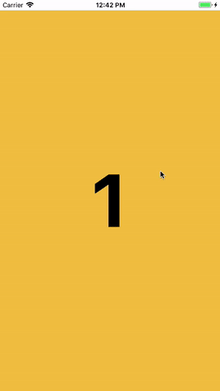

# YHInfiniteScrollView

[](https://travis-ci.org/yonghwinam/YHInfiniteScrollView)
[](http://cocoapods.org/pods/YHInfiniteScrollView)
[](http://cocoapods.org/pods/YHInfiniteScrollView)
[](http://cocoapods.org/pods/YHInfiniteScrollView)

## Preview



## Requirements

* Swift 3 +
* iOS 9 +

## Installation

YHInfiniteScrollView is available through [CocoaPods](http://cocoapods.org). To install
it, simply add the following line to your Podfile:

```ruby
pod 'YHInfiniteScrollView'
```

## Usage

Configure with layout constraints

```
import UIKit
import YHInfiniteScrollView


override func viewDidLoad() {
super.viewDidLoad()

// Create content view controllers or views
let firstViewContorller = self.storyboard?.instantiateViewController(withIdentifier: "FirstViewController")
let secondViewController = self.storyboard?.instantiateViewController(withIdentifier: "SecondViewController")
let thirdViewController = self.storyboard?.instantiateViewController(withIdentifier: "ThirdViewController")
let fourthViewController = self.storyboard?.instantiateViewController(withIdentifier: "FourthViewController")
let fifthViewController = self.storyboard?.instantiateViewController(withIdentifier: "FifthViewController")

self.addChildViewController(firstViewContorller!)
self.addChildViewController(secondViewController!)
self.addChildViewController(thirdViewController!)
self.addChildViewController(fourthViewController!)
self.addChildViewController(fifthViewController!)

// Initialize infinite scroll view with contents
let infiniteScrollView = YHInfiniteScrollView.init(frame: CGRect.zero,
contentObjects: [firstViewContorller!, secondViewController!, thirdViewController!, fourthViewController!, fifthViewController! ])
infiniteScrollView.translatesAutoresizingMaskIntoConstraints = false
infiniteScrollView.delegate = self

// Add infinite scroll view to container view (assume that existing container view)
self.mainContainer.addSubview(infiniteScrollView)

// Add layuout contraints
let alcTop = NSLayoutConstraint.init(item: infiniteScrollView, attribute: .top, relatedBy: .equal, toItem: self.mainContainer, attribute: .top, multiplier: 1.0, constant: 0.0)
let alcLeading = NSLayoutConstraint.init(item: infiniteScrollView, attribute: .leading, relatedBy: .equal, toItem: self.mainContainer, attribute: .leading, multiplier: 1.0, constant: 0.0)
let alcBottom = NSLayoutConstraint.init(item: infiniteScrollView, attribute: .bottom, relatedBy: .equal, toItem: self.mainContainer, attribute: .bottom, multiplier: 1.0, constant: 0.0)
let alcTrailing = NSLayoutConstraint.init(item: infiniteScrollView, attribute: .trailing, relatedBy: .equal, toItem: self.mainContainer, attribute: .trailing, multiplier: 1.0, constant: 0.0)

self.mainContainer.addConstraints([alcTop, alcLeading, alcBottom, alcTrailing])
}

```

Configure with frame

```
override func viewDidLoad() {
super.viewDidLoad()

let firstViewContorller = self.storyboard?.instantiateViewController(withIdentifier: "FirstViewController")
let secondViewController = self.storyboard?.instantiateViewController(withIdentifier: "SecondViewController")
let thirdViewController = self.storyboard?.instantiateViewController(withIdentifier: "ThirdViewController")
let fourthViewController = self.storyboard?.instantiateViewController(withIdentifier: "FourthViewController")
let fifthViewController = self.storyboard?.instantiateViewController(withIdentifier: "FifthViewController")

self.addChildViewController(firstViewContorller!)
self.addChildViewController(secondViewController!)
self.addChildViewController(thirdViewController!)
self.addChildViewController(fourthViewController!)
self.addChildViewController(fifthViewController!)

let contentObjects = [firstViewContorller!, secondViewController!, thirdViewController!, fourthViewController!, fifthViewController!]

// Frame for infinite scroll view
let infiniteRect = CGRect.init(origin: .zero, size: CGSize.init(width: SCREEN_WIDTH, height: SCREEN_HEIHGT - STATUSBAR_HEIGHT))

// Initialize infinite scroll view with contents
let infiniteScrollView = YHInfiniteScrollView.init(frame: infiniteRect, contentObjects: contentObjects)
infiniteScrollView.delegate = self

// Add infinite scroll view to container view (assume that existing container view)
self.mainContainer.addSubview(infiniteScrollView)
}

```

Public Method

```
//
func scrollToContentView(toIndex: Int)
```

Delegate

```
func didScroll(atContentOffsetX: CGFloat)

func willScrollToNextView(atIndex: Int)
func willScrollToNextView(atIndex: Int, contentObject: Any)

func didScrollToNextView(atIndex: Int)
func didScrollToNextView(atIndex: Int, contentObject: Any)

func willScrollToPreviousView(atIndex: Int)
func willScrollToPreviousView(atIndex: Int, contentObject: Any)

func didScrollToPreviousView(atIndex: Int)
func didScrollToPreviousView(atIndex: Int, contentObject: Any)
```

## Author

Yonghwi (yonghwi.nam@gmail.com)

## License

YHInfiniteScrollView is available under the MIT license. See the LICENSE file for more info.
